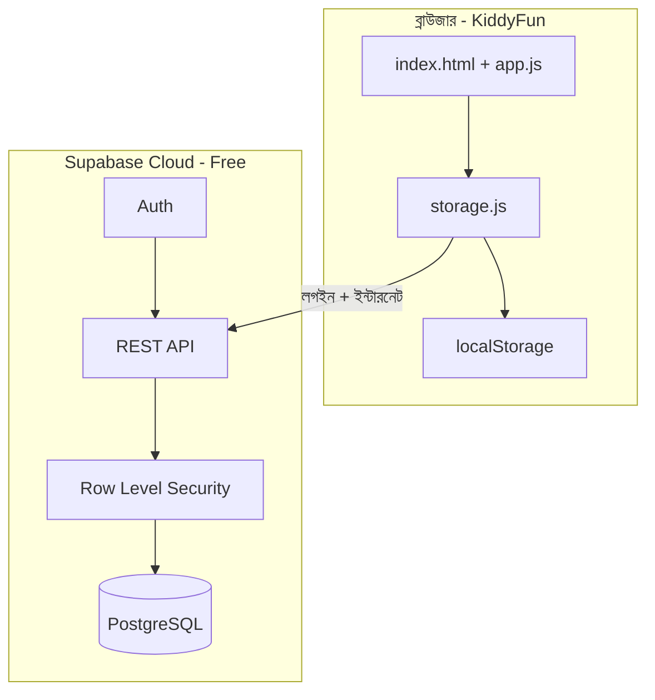

# KiddyFun Code — সম্পূর্ণ Supabase গাইডলাইন

এই ডকুমেন্ট Programming School-এর **KiddyFun Code** প্রজেক্টে Supabase সেটআপ, টেস্ট, শিক্ষক/শিক্ষার্থী ব্যবহার, নিরাপত্তা ও সমস্যা সমাধানের জন্য ধাপে ধাপে নির্দেশিকা।

**সংক্ষিপ্ত সারাংশ:** অ্যাপ **offline-first** — ডেটা আগে `localStorage`-এ যায়; Supabase চালু ও সাইন-ইন থাকলে ক্লাউডে সিঙ্ক হয়। ব্রাউজার থেকে সরাসরি MySQL/PostgreSQL সংযোগ করা হয় না; শুধু **anon public key** + **Row Level Security (RLS)** ব্যবহার করা হয়।

---

## সূচিপত্র

1. [Supabase কী এবং কেন](#1-supabase-কী-এবং-কেন)
2. [প্রয়োজনীয় জিনিস](#2-প্রয়োজনীয়-জিনিস)
3. [ধাপ ১: অ্যাকাউন্ট ও প্রজেক্ট](#3-ধাপ-১-অ্যাকাউন্ট-ও-প্রজেক্ট)
4. [ধাপ ২: ডেটাবেস স্কিমা (SQL)](#4-ধাপ-২-ডেটাবেস-স্কিমা-sql)
5. [ধাপ ৩: Authentication সেটআপ](#5-ধাপ-৩-authentication-সেটআপ)
6. [ধাপ ৪: API কী ও প্রজেক্ট কনফিগ](#6-ধাপ-৪-api-কী-ও-প্রজেক্ট-কনফিগ)
7. [ধাপ ৫: অ্যাপে টেস্ট](#7-ধাপ-৫-অ্যাপে-টেস্ট)
8. [ডেটাবেস টেবিল ব্যাখ্যা](#8-ডেটাবেস-টেবিল-ব্যাখ্যা)
9. [সিঙ্ক কীভাবে কাজ করে](#9-সিঙ্ক-কীভাবে-কাজ-করে)
10. [শিক্ষক ও ক্লাস সেটআপ](#10-শিক্ষক-ও-ক্লাস-সেটআপ)
11. [GitHub Pages / লাইভ সাইট](#11-github-pages--লাইভ-সাইট)
12. [নিরাপত্তা চেকলিস্ট](#12-নিরাপত্তা-চেকলিস্ট)
13. [ফ্রি টিয়ার সীমা](#13-ফ্রি-টিয়ার-সীমা)
14. [সমস্যা সমাধান (Troubleshooting)](#14-সমস্যা-সমাধান-troubleshooting)
15. [ফাইল মানচিত্র](#15-ফাইল-মানচিত্র)

---

## 1. Supabase কী এবং কেন

| বিষয় | ব্যাখ্যা |
|--------|---------|
| **Supabase** | ক্লাউডে PostgreSQL ডেটাবেস + Auth + REST API (BaaS) |
| **কেন বেছে নিয়েছি** | টিচার/ক্লাস/প্রোগ্রেস relational টেবিলে সহজ; RLS দিয়ে শিশুর ডেটা আলাদা; vanilla JS-এ CDN দিয়ে চলে |
| **Firebase এর বদলে** | Firestore-এ ক্লাস রিপোর্ট ও JOIN কঠিন; KiddyFun-এ Supabase বেশি মানানসই |



---

## 2. প্রয়োজনীয় জিনিস

- [supabase.com](https://supabase.com) এ ফ্রি অ্যাকাউন্ট (GitHub দিয়ে লগইন করা যায়)
- KiddyFun রিপো লোকালি বা GitHub Pages-এ হোস্ট
- আধুনিক ব্রাউজার (Chrome, Edge, Firefox, Safari)
- **ইন্টারনেট** — শুধু ক্লাউড সিঙ্কের সময় (অফলাইনে লেখা/রান চলবে)

---

## 3. ধাপ ১: অ্যাকাউন্ট ও প্রজেক্ট

### 3.1 নতুন প্রজেক্ট

1. [https://supabase.com/dashboard](https://supabase.com/dashboard) → **New project**
2. **Organization:** নিজের (বা নতুন তৈরি)
3. **Name:** যেমন `kiddyfun-code`
4. **Database password:** শক্তিশালী পাসওয়ার্ড — **সংরক্ষণ করুন** (pgAdmin/সরাসরি DB সংযোগে লাগতে পারে)
5. **Region:** ব্যবহারকারীর কাছে — এশিয়ার জন্য `Southeast Asia (Singapore)` ভালো
6. **Create new project** — ১–২ মিনিট অপেক্ষা

### 3.2 প্রজেক্ট তথ্য নোট করুন

Dashboard → **Project Settings** → **General**:

- **Reference ID** (প্রজেক্ট আইডি)
- **Project URL** — পরে `supabase-config.js`-এ লাগবে

---

## 4. ধাপ ২: ডেটাবেস স্কিমা (SQL)

### 4.1 মাইগ্রেশন চালানো

1. Dashboard → **SQL Editor** → **New query**
2. লোকাল ফাইল খুলুন: [`supabase/migrations/001_initial_schema.sql`](../supabase/migrations/001_initial_schema.sql)
3. **সম্পূর্ণ** কপি করে SQL Editor-এ পেস্ট করুন
4. **Run** (বা Ctrl+Enter)
5. **দ্বিতীয় query:** [`002_security_hardening.sql`](../supabase/migrations/002_security_hardening.sql) — role escalation বন্ধ
6. নিচে **Success** দেখতে হবে — কোনো লাল error থাকলে [§14](#14-সমস্যা-সমাধান-troubleshooting) দেখুন

> **ড্যাশবোর্ড-only চেকলিস্ট:** [`SUPABASE_DASHBOARD_SETUP.md`](SUPABASE_DASHBOARD_SETUP.md)

### 4.2 যা তৈরি হয়

| টেবিল | কাজ |
|--------|-----|
| `profiles` | nickname, role, class_code |
| `programs` | সেভ করা কোড |
| `mission_progress` | সম্পন্ন মিশন |
| `badges` | অর্জিত ব্যাজ |
| `classes` | শিক্ষকের ক্লাস + `class_code` |
| `class_members` | কোন শিক্ষার্থী কোন ক্লাসে |

এছাড়া:

- **RLS** সব পাবলিক টেবিলে চালু
- **`handle_new_user`** — নতুন লগইনে স্বয়ং `profiles` row
- **`join_class_by_code()`** — শিক্ষার্থী ক্লাস কোড দিয়ে জয়েন

### 4.3 যাচাই

**Table Editor**-এ `profiles`, `programs` ইত্যাদি দেখা যাচ্ছে কিনা চেক করুন।

---

## 5. ধাপ ৩: Authentication সেটআপ

Dashboard → **Authentication** → **Providers**

### 5.1 Anonymous sign-ins (অবশ্যই)

শিশুর **এক-ট্যাপ সিঙ্ক** এর জন্য:

1. **Anonymous sign-ins** → **Enable**
2. Save

অ্যাপে: মেনু → **☁️ Sync** → **Start syncing (one tap)**

### 5.2 Email (ঐচ্ছিক — অভিভাবক)

1. **Email** → Enable
2. **Confirm email** — পাইলটে বন্ধ রাখতে পারেন; প্রডাকশনে চালু করুন
3. **Authentication** → **URL Configuration**:
   - **Site URL:** আপনার লাইভ সাইট, যেমন  
     `https://programmingschool-cm.github.io/kiddyfun/`
   - **Redirect URLs**-এ একই URL + লোকাল টেস্ট:
     - `http://localhost:5500`
     - `http://127.0.0.1:5500`
     - `http://localhost:5500/index.html`

Magic link ক্লিক করলে ব্যবহারকারী এই URL-এ ফিরে আসবে।

### 5.3 Anonymous → Email লিংক (ভবিষ্যৎ)

Supabase-এ anonymous ইউজারকে পরে email দিয়ে “upgrade” করা যায়; বর্তমান KiddyFun UI-তে অভিভাবক আলাদা **Email magic link** বাটন আছে। উন্নত ফ্লো পরে ROADMAP-এ যোগ করা যাবে।

---

## 6. ধাপ ৪: API কী ও প্রজেক্ট কনফিগ

### 6.1 কোন কী কোথায় (২০২৫+ UI)

পুরনো **Settings → API** মেনু সরানো হয়েছে। এখন:

- **Connect** (প্রজেক্ট হোম, উপরে ডান), অথবা
- **Project Settings** (⚙️) → **API Keys** → **Publishable** বা **Legacy API Keys** → `anon`

| কী | ব্রাউজারে? | ব্যবহার |
|----|------------|---------|
| **Project URL** | হ্যাঁ | `supabase-config.js` → `url` |
| **Publishable** `sb_publishable_...` | হ্যাঁ | `anonKey` (নতুন, প্রথম পছন্দ) |
| **anon (legacy)** `eyJ...` | হ্যাঁ | `anonKey` (পুরনো JWT — এখনও চলে) |
| **Secret / service_role** | **না — কখনো না** | RLS বাইপাস করে |

বিস্তারিত স্ক্রিন পথ: [`SUPABASE_DASHBOARD_SETUP.md`](SUPABASE_DASHBOARD_SETUP.md) §ধাপ ৪

### 6.2 কনফিগ ফাইল এডিট

[`assets/js/supabase-config.js`](../assets/js/supabase-config.js) খুলে:

```javascript
(function () {
  'use strict';
  var base = {
    url: 'https://abcdefghijklmnop.supabase.co',
    anonKey: 'eyJhbGciOiJIUzI1NiIsInR5cCI6IkpXVCJ9...',
  };
  // ... বাকি ফাইল অপরিবর্তিত
})();
```

**খালি `url` / `anonKey` রাখলে:** অ্যাপ শুধু localStorage — কোনো error নেই।

### 6.3 লোকাল ওভাররাইড (Git-এ কী commit না করতে চাইলে)

1. `assets/js/supabase-config.local.js.example` কপি করে  
   `assets/js/supabase-config.local.js` বানান
2. [`index.html`](../index.html)-এ আনকমেন্ট করুন:

```html
<script src="assets/js/supabase-config.local.js"></script>
```

3. `.gitignore`-এ `supabase-config.local.js` ইতিমধ্যে আছে

---

## 7. ধাপ ৫: অ্যাপে টেস্ট

### 7.1 লোকালি চালানো

VS Code **Live Server**, বা:

```bash
# Python 3
cd kiddy
python -m http.server 5500
```

ব্রাউজার: `http://localhost:5500/index.html`

### 7.2 সিঙ্ক টেস্ট চেকলিস্ট

| # | কাজ | প্রত্যাশিত ফল |
|---|-----|----------------|
| 1 | মেনু খুলুন | উপরে `☁️ Cloud sync` স্ট্যাটাস দেখা যায় |
| 2 | **☁️ Sync** ট্যাব | সাইন-ইন ফর্ম |
| 3 | Nickname দিয়ে **Start syncing** | “You are synced!” টোস্ট |
| 4 | কোড লিখে **💾 Save** | Saved তালিকায় দেখা যায় |
| 5 | Supabase → **Table Editor** → `programs` | নতুন row (`user_id`, `name`, `code`) |
| 6 | মিশন সম্পন্ন করুন | `mission_progress` টেবিলে row |
| 7 | **↻ Sync now** | ত্রুটি ছাড়া সম্পন্ন |
| 8 | অন্য ব্রাউজার/ডিভাইসে একই অ্যাকাউন্ট | *(anonymous প্রতি ডিভাইসে আলাদা — email লিংক দিয়ে পরে একীভূত করা যায়)* |

### 7.3 ডেভেলপার কনসোল

F12 → **Console**:

- `[KiddyFun] Storage ready (cloud configured)` — কী ঠিক
- `[KiddyCloud] sync error` — RLS বা নেটওয়ার্ক সমস্যা

**Network** ট্যাবে `supabase.co`-তে request 200/201 দেখুন।

---

## 8. ডেটাবেস টেবিল ব্যাখ্যা

### `profiles`

| কলাম | অর্থ |
|-------|------|
| `id` | `auth.users.id` এর সাথে একই |
| `display_name` | শিশুর nickname (PII কম) |
| `role` | `student` \| `teacher` \| `parent` |
| `class_code` | শিক্ষকের দেওয়া কোড, যেমন `SUNNY-42` |

### `programs`

| কলাম | অর্থ |
|-------|------|
| `user_id` | মালিক |
| `name` | প্রোগ্রামের নাম (ইউনিক per user) |
| `code` | KiddyFun সোর্স কোড |
| `saved_at` | সিঙ্ক কনফ্লিক্টের জন্য |

### `mission_progress` / `badges`

- `mission_id` / `badge_id` — অ্যাপের `missions.js` আইডি স্ট্রিং

### `classes` / `class_members`

- শিক্ষক `classes` তৈরি করে; শিক্ষার্থী `join_class_by_code` দিয়ে যোগ দেয়

---

## 9. সিঙ্ক কীভাবে কাজ করে

```
লেখা/সেভ → localStorage (তৎক্ষণাৎ)
         → যদি লগইন + ক্লাউড চালু → Supabase upsert
অফলাইন   → ss_sync_pending কিউতে জমা
অনলাইন   → কিউ flush + pullFromCloud
```

| ইভেন্ট | লোকাল | ক্লাউড |
|--------|-------|--------|
| `saveProgram` | `ss_saved_programs` | `programs` upsert |
| `completeMission` | `ss_completed_missions` | `mission_progress` |
| `awardBadge` | `ss_badges` | `badges` |
| `saveLastCode` | `ss_last_code` | *(ক্লাউডে যায় না — ডিভাইস ক্যাশ)* |

**কনফ্লিক্ট:** একই প্রোগ্রাম নামে লোকাল ও রিমোট থাকলে **যার `saved_at` নতুন** সেটা জয়ী।

---

## 10. শিক্ষক ও ক্লাস সেটআপ

বর্তমানে **টিচার UI অ্যাপে নেই** — Supabase Dashboard/SQL দিয়ে সেটআপ।

### 10.1 শিক্ষক অ্যাকাউন্ট

1. নিজে **Email magic link** দিয়ে লগইন (Sync প্যানেল)
2. **Authentication** → **Users** → সেই user-এর UUID কপি
3. **Table Editor** → `profiles` → সেই row → `role` = `teacher`

### 10.2 ক্লাস তৈরি (SQL Editor)

`YOUR_TEACHER_UUID` বদলে দিন:

```sql
insert into public.classes (teacher_id, name, class_code)
values (
  'YOUR_TEACHER_UUID',
  'Class 3A Morning',
  'SUNNY-42'
);
```

শিক্ষার্থীদের বলুন: মেনু → **☁️ Sync** → সাইন-ইন → Class code `SUNNY-42` → **Join**

### 10.3 রোস্টার দেখা (SQL)

```sql
select p.display_name, p.class_code, cm.joined_at
from public.class_members cm
join public.profiles p on p.id = cm.student_id
join public.classes c on c.id = cm.class_id
where c.class_code = 'SUNNY-42';
```

*(ভবিষ্যতে Phase C1-এ টিচার ড্যাশবোর্ড UI আসবে)*

---

## 11. GitHub Pages / লাইভ সাইট

**GitHub Pages + Supabase = recommended production setup** (no backend on GitHub). Step-by-step: [`GITHUB_PAGES.md`](GITHUB_PAGES.md).

1. `supabase-config.js`-এ প্রডাকশন URL/anonKey কমিট করা **যায়** (anon key পাবলিক ডিজাইন)
2. Supabase → **Authentication** → **URL Configuration**:
   - **Site URL** = GitHub Pages URL
   - **Redirect URLs**-এ সেই URL যোগ
3. পুশ করার পর Hard refresh (Ctrl+F5)

**CORS:** Supabase ডিফল্টভাবে ব্রাউজার REST অনুমতি দেয়; সমস্যা হলে Dashboard → **API** সেটিংস দেখুন।

---

## 12. নিরাপত্তা চেকলিস্ট

- [ ] শুধু **anon** key ফ্রন্টএন্ডে; `service_role` কখনো নয়
- [ ] RLS সব টেবিলে **enabled** (মাইগ্রেশন চালানোর পর)
- [ ] Anonymous + Email প্রোভাইডার ইচ্ছামতো চালু
- [ ] Redirect URL শুধু আপনার ডোমেইন
- [ ] শিশুর কাছ থেকে শুধু **nickname**, পূর্ণ নাম/ফোন/ঠিকানা চাওয়া নয়
- [ ] গ্যালারি/পাবলিক শেয়ার (ROADMAP) আসলে `published` + মডারেশন যোগ করুন
- [ ] প্রডাকশনে Supabase **ব্যাকআপ** ও **পাসওয়ার্ড** নিরাপদ জায়গায়

---

## 13. ফ্রি টিয়ার সীমা

সর্বশেষ তথ্যের জন্য দেখুন: [https://supabase.com/pricing](https://supabase.com/pricing)

আনুমানিক (পরিবর্তন হতে পারে):

| রিসোর্স | ফ্রি টিয়ার (আনুমানিক) |
|---------|------------------------|
| Database | ~৫০০ MB |
| Auth MAU | মাসিক সক্রিয় ইউজার সীমা |
| API requests | দৈনিক সীমা |
| Bandwidth | সীমিত |

ছোট স্কুল পাইলটের জন্য সাধারণত যথেষ্ট; বড় ট্র্যাফিকে Pro প্ল্যান বিবেচনা।

**পজ করা প্রজেক্ট:** ৭ দিন নিষ্ক্রিয় থাকলে Supabase পজ করতে পারে — Dashboard থেকে unpause।

---

## 14. সমস্যা সমাধান (Troubleshooting)

### “Could not sign in. Enable Anonymous auth in Supabase.”

→ **Authentication** → **Providers** → **Anonymous sign-ins** → Enable

### “Cloud not configured” / সিঙ্ক বাটন কাজ করে না

→ `supabase-config.js`-এ `url` ও `anonKey` খালি নয় কিনা; ব্রাউজার কনসোলে `[KiddyFun] Storage ready (cloud configured)`

### SQL migration error: `relation already exists`

→ টেবিল আগে থেকেই আছে। নতুন প্রজেক্টে চালান, অথবা শুধু নতুন অংশ চালান; প্রয়োজনে **নতুন** Supabase প্রজেক্ট।

### `new row violates row-level security policy`

→ ইউজার লগইন নেই, অথবা `user_id` ≠ `auth.uid()`। সাইন-ইন পর আবার চেষ্টা।  
→ `profiles` row নেই: `handle_new_user` ট্রিগার চালু কিনা দেখুন।

### Magic link কাজ করে না

→ **Redirect URLs**-এ সাইট URL ঠিক আছে কিনা  
→ স্প্যাম ফোল্ডার  
→ **Site URL** মিলছে কিনা

### `Class code not found`

→ `classes` টেবিলে সেই `class_code` আছে কিনা (বড় হাতের অক্ষরে normalize হয়)  
→ শিক্ষার্থী আগে **সাইন-ইন** করেছে কিনা

### Programs সিঙ্ক হয় না কিন্তু লোকাল সেভ হয়

→ ইন্টারনেট + লগইন চেক  
→ Network ট্যাবে 401/403 → RLS বা কী ভুল  
→ `ss_sync_pending` কিউ — অনলাইনে গিয়ে **Sync now**

### GitHub Pages-এ CORS / Auth redirect ভুল

→ Supabase-এ প্রডাকশন URL **হুবহু** যোগ (ট্রেইলিং `/` সহ/ছাড়া মিলিয়ে নিন)

---

## 15. ফাইল মানচিত্র

| ফাইল | ভূমিকা |
|------|--------|
| [`supabase/migrations/001_initial_schema.sql`](../supabase/migrations/001_initial_schema.sql) | DB + RLS + RPC |
| [`assets/js/supabase-config.js`](../assets/js/supabase-config.js) | URL + anon key |
| [`assets/js/supabase-client.js`](../assets/js/supabase-client.js) | `createClient` |
| [`assets/js/supabase-sync.js`](../assets/js/supabase-sync.js) | push/pull, offline queue |
| [`assets/js/supabase-auth.js`](../assets/js/supabase-auth.js) | Sync UI, sign-in/out |
| [`assets/js/storage.js`](../assets/js/storage.js) | localStorage + sync hooks |
| [`index.html`](../index.html) | Supabase CDN + script order |
| [`docs/BACKEND.md`](BACKEND.md) | সংক্ষিপ্ত রেফারেন্স |

**Script লোড ক্রম** (`index.html`):

1. `@supabase/supabase-js` (CDN)  
2. `supabase-config.js` (+ optional local)  
3. `supabase-client.js` → `supabase-sync.js`  
4. `storage.js` → `supabase-auth.js`  
5. বাকি অ্যাপ স্ক্রিপ্ট  

---

## দ্রুত শুরু (৫ মিনিট)

1. Supabase প্রজেক্ট তৈরি  
2. SQL Editor-এ `001_initial_schema.sql` Run  
3. Anonymous (+ Email) চালু  
4. API থেকে URL + anon key → `supabase-config.js`  
5. `index.html` খুলে মেনু → **☁️ Sync** → **Start syncing**  
6. Table Editor-এ `programs` যাচাই  

---

## আরও পড়াশোনা

- [Supabase Docs — JavaScript Client](https://supabase.com/docs/reference/javascript/introduction)
- [Supabase Auth — Anonymous](https://supabase.com/docs/guides/auth/auth-anonymous)
- [Row Level Security](https://supabase.com/docs/guides/database/postgres/row-level-security)
- KiddyFun রোডম্যাপ: [`ROADMAP.md`](../ROADMAP.md) Phase C1–C2

---

*Programming School — Cumilla · KiddyFun Code v1.0+*
